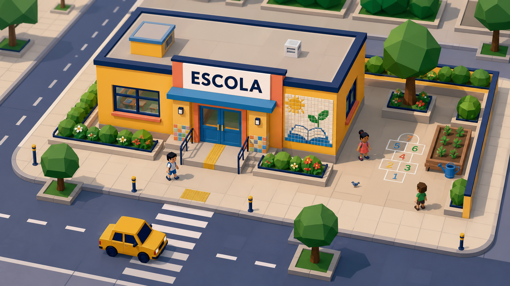

# Órbi — Escola e entorno: proposta visual de implementação

Data: 05/09/2026.

Estado: direção artística aprovada; proposta técnica preparada para revisão. Nenhuma implementação desta proposta foi executada. A aprovação para preparar a proposta não autoriza commit, publicação ou mudanças curriculares.

## Objetivo

Transformar a escola no primeiro ponto de referência de uma cidade mais colorida, acolhedora e interessante para explorar. Público previsto: 3–10 anos. A escola deve ser reconhecível pela câmera atual e manter as rotas de circulação livres.

Imagem gerada com a ferramenta integrada de imagens e aprovada pelo usuário. É referência de direção artística, não captura do jogo implementado nem promessa de equivalência gráfica. A renderização real deve usar a iluminação e o enquadramento atuais.

## Contexto confirmado

- Checkout do jogo: `C:/Users/ander/Cidade-Turbo-3D`.
- Branch: `feature/orbi-golden-rebuild`; HEAD observado: `6aaaff4`.
- Padaria 02.B e hotfix de saída da garagem possuem alterações locais sem commit. Preservar integralmente esses arquivos.
- `City.jsx` monta todos os prédios com `Building.jsx` a partir de `BAIRROS`.
- Escola: posição XZ `[0, 38]`, dimensões `[16, 7, 12]`; lote visual atual de 20 × 20 unidades, X `[-10, 10]`, Z `[28, 48]`.
- O letreiro é deitado no telhado. A câmera acompanha o carro com deslocamento `(0, 44, 24)`; não usar a câmera da imagem conceitual como especificação do jogo.
- Colisores automáticos de `Building` dependem das malhas sob seu `RigidBody`. Adicionar decoração dentro desse corpo pode mudar a colisão involuntariamente.
- A fileira de moedas em X=12 passa ao lado leste do lote. Já existem bancos próximos em `[-12,42]` e `[12,42]`, e um gato em `[-14,32]`.
- As decorações existentes são estáticas e sem colisão. O piloto deve seguir essa fronteira.
- A escola atualmente não possui Chegada Viva. A proposta visual não muda esse comportamento.

## Alternativas avaliadas

1. **Camada visual exclusiva sobre o prédio atual — recomendada.** Mantém colisão, posição e missão; permite retirar a decoração sem desfazer o prédio. A arquitetura visual precisa respeitar a caixa existente.
2. **Substituir a escola por um modelo 3D completo.** Aproxima a silhueta da imagem, mas exige resolver colisões, materiais e carregamento de um novo asset. Não é necessário para comprovar a direção.
3. **Redesenhar todos os prédios pelo componente comum.** Tem alcance sobre a cidade inteira e dificulta comparar o piloto. Não atende ao recorte aprovado de começar pela escola.

## Piloto visual proposto

### Fachada e identidade

- Preservar amarelo da escola e contorno navy.
- Acrescentar porta fechada azul, janelas simples, moldura coral e pequena cobertura de entrada. A porta é cenográfica; não sugerir um interior já acessível.
- Manter o letreiro atual no telhado. Uma moldura discreta no teto e cores nos elementos baixos ajudam a identificar a escola de cima.
- Não copiar o carro, a câmera, os materiais fotográficos ou as sombras da imagem conceitual.

### Pixel art

- Usar um mural quadrado com desenho de livro e um pequeno motivo de sol ou planta. O motivo inicial do código de referência é o livro.
- Os pixels aparecem nos azulejos e mosaicos; a arquitetura principal permanece em 3D simples.
- Usar malhas instanciadas, agrupadas por geometria/material. Nunca criar uma textura externa ou uma draw call por azulejo.
- Manter superfícies amplas sem estampas. O mural é um detalhe de descoberta, não substitui a placa ESCOLA.

### Entorno

- Dois canteiros baixos com vegetação facetada na frente, fora do corredor de chegada.
- Jardim/horta compacta junto ao fundo do lote e um motivo de brincadeira pintado no piso, sem pergunta, numeral de avaliação ou recompensa.
- Adaptar a quantidade de elementos ao lote existente. Não alargar a escola nem ocupar a fileira de moedas a leste.
- Não duplicar os bancos, o gato ou as faixas de travessia já existentes na área. A travessia extensa da imagem é referência compositiva, não uma nova rua a construir.
- Nenhum obstáculo físico novo. As decorações seguem a convenção atual de cenário atravessável; posicioná-las fora da aproximação principal para reduzir atravessamentos visuais.

### Sinais de vida

O primeiro piloto comprova cor, reconhecimento e composição com vegetação e detalhes de uso cotidiano. Pessoas caminhando, animais com novos comportamentos e interação com horta não pertencem a esta entrega: exigem especificação de comportamento própria.

Uma etapa seguinte pode acrescentar movimento de folhas ou bandeirinhas, limitado ao entorno da escola, após medir o piloto estático. Deve respeitar a preferência de movimento reduzido, parar fora de vista e manter a circulação previsível. Nenhum loop de animação é necessário no primeiro piloto.

## Integração proposta

`City` continua montando o `Building` existente. Para o item ESCOLA, monta um `SchoolEnvironment` como irmão do `Building`, sob um grupo comum. Não colocar as malhas novas dentro de `RigidBody`.

Arquivos futuros:

| Arquivo | Responsabilidade |
|---|---|
| `src/components/City.jsx` | Selecionar a camada visual somente para ESCOLA. |
| `src/components/school/SchoolEnvironment.jsx` | Renderizar fachada, canteiros, jardim e mural. |
| `src/components/school/school-layout.js` | Descritores locais de posição, escala e cor; nenhum estado de jogo. |
| `tests/school-layout.test.js` | Verificar limites espaciais, aproximação livre e isolamento dos dados. |
| `docs/ORBI_SCHOOL_VISUAL_RESULT.md` | Evidências futuras, medidas e limitações do piloto. |

Nenhuma dependência nova. React, React Three Fiber, Drei e Three.js já instalados são suficientes. Usar `TINTAS`/`PALETA3D`, sem criar uma segunda paleta.

## Limites e critérios espaciais

- Coordenadas da decoração relativas ao centro da escola.
- Limite local do lote: X/Z `[-10,10]`.
- Corredor livre de volumes baixos: X `[-3.2,3.2]`, Z `[6.4,10]`.
- Porta e janelas ficam além do contorno visual, com afastamento suficiente para não piscar; a cobertura fica acima da altura de passagem.
- Piso decorativo opaco em Y=0.026, acima da calçada Y=0.02 e abaixo das sombras Y=0.03/0.034. Conferir ausência de z-fighting na cena real.
- Todo volume tem escala positiva e coordenadas finitas. Verificar a extensão completa, não apenas o centro.
- A planta não contém árvore adicional no canteiro contável do Parque nem objeto com aparência de moeda coletável no chão.

## Preservação do jogo

- Preservar os arquivos e hashes locais da Padaria e da garagem.
- Não alterar `Building.jsx`, `bairros.js`, `Game.jsx`, câmera, carro, física, sensores, moedas, combustível, economia, HUD ou controles.
- Não alterar save v6, sua allowlist de 11 campos ou as habilidades persistidas.
- Não modificar conteúdo curricular nem iniciar etapas 02.C/02.D/02.E ou uma BUILD 03 por consequência deste piloto.
- O piloto visual deve ter histórico próprio quando o commit for autorizado. Não incluir Padaria ou garagem por conveniência.

## Orçamento de desempenho proposto

Estes valores são limites de aceitação a medir, não resultados já obtidos:

- Acréscimo máximo inicial: 20 draw calls e 8.000 triângulos visíveis sobre a mesma cena-base.
- Sem novas luzes, sombras dinâmicas, pós-processamento, downloads de modelos, fontes ou texturas.
- Malhas compartilhadas/instanciadas por família; nenhum estado React atualizado a cada quadro.
- Comparar duas amostras de 30 segundos após aquecimento, no mesmo aparelho, viewport e percurso: antes e depois. Registrar mediana e p95 do tempo de quadro.
- Alvo: mediana de tempo de quadro até 10% acima da base e p95 até 15% acima; mediana absoluta até 33,3 ms. Se a própria base não atingir esse piso, registrar a limitação antes de aprovar o piloto.
- Medições em navegador sem aceleração gráfica não aprovam desempenho de celular. Não reduzir DPR, antialiasing, física ou zoom para mascarar custo da decoração.
- Se o orçamento estourar, simplificar apenas a decoração deste piloto e repetir a comparação relevante.

## Aceitação

1. Escola reconhecível no gameplay real, com ESCOLA legível nos dois zooms existentes.
2. Fachada/pátio mais coloridos e mural discernível sem prejudicar caminho, carro ou letreiro.
3. Testar desktop e landscape 740×360, 844×390 e 915×412; portrait continua protegido pelo gate existente.
4. Testar as cores/contrastes nos três estados de iluminação existentes.
5. Dar a volta na escola, encostar no prédio, entrar/sair da zona de chegada e coletar moedas no corredor leste: comportamento igual à base.
6. Confirmar que outros prédios permanecem visual e funcionalmente iguais.
7. Testes automatizados, build e diff check passam; o warning de bundle conhecido é registrado separadamente.
8. Validação humana touch obrigatória. Screenshots de conceito e teste isolado de componente não equivalem a aprovação do jogo completo.

## Sequência

Preparação da proposta → implementação local do piloto estático → validação visual e medições → avaliação humana no celular → decisão sobre commit isolado → especificação posterior de movimentos e atividades escolares.

As validações pendentes de garagem e Padaria continuam pendentes. Não usar a aprovação deste visual para marcá-las como concluídas.
